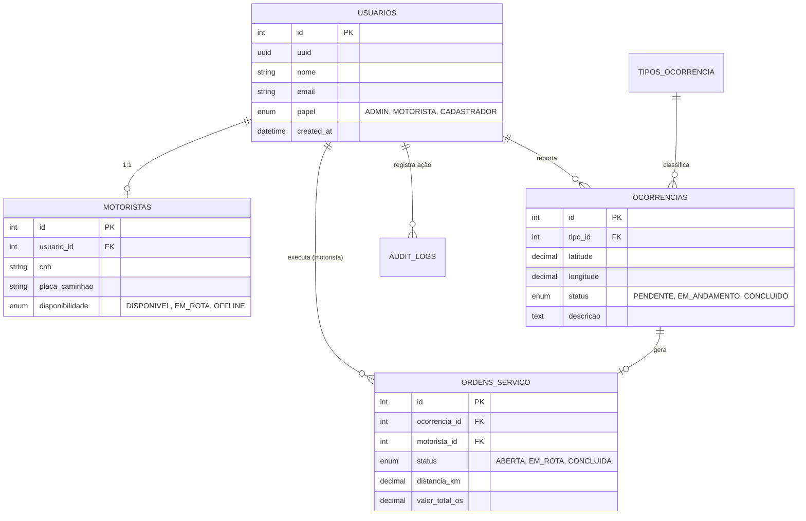

# 📍 ZelaMapa (v4.0 Elite)

[](https://fastapi.tiangolo.com/)
[](https://reactjs.org/)
[](https://tailwindcss.com/)
[](https://www.mysql.com/)

**ZelaMapa** é uma solução **GovTech** de ponta desenvolvida para otimizar o zeladoria urbana e a gestão de serviços municipais. Combinando monitoramento em tempo real, inteligência de dados e uma interface intuitiva, o sistema conecta cidadãos, gestores e equipes operacionais para transformar a manutenção das cidades.

---

## 🏗️ Arquitetura do Sistema

O projeto segue uma arquitetura moderna e escalável:

- **Core API:** Engine de alta performance construída com FastAPI, utilizando padrão de repositório e injeção de dependência.
- **Frontend Dashboard:** Aplicação administrativa em React com arquitetura baseada em componentes e gerenciamento de estado global.
- **Driver App:** Interface mobile-first otimizada para operação em campo com mapas interativos e geolocalização persistente.
- **Real-time Engine:** Integração via WebSockets para rastreamento de frotas e notificações instantâneas.

---

## 🗄️ Estrutura do Banco de Dados

Nossa modelagem de dados foi projetada para garantir integridade, rastreabilidade (logs de auditoria) e performance analítica.

### Diagrama de Relacionamentos (ER)



### Principais Entidades
- **Usuários:** Gestão de acesso (RBAC) com níveis de permissão distintos.
- **Ocorrências:** Registro georreferenciado de demandas urbanas (Entulho, Poda, Lixo, etc).
- **Ordens de Serviço:** Controle operacional de execução com snapshot de custos e distância.
- **Motoristas:** Extensão do usuário com dados técnicos de frotas e CNH.
- **Auditoria:** Registro nominal de cada alteração sensível no sistema (v4.0).

---

## 🛠️ Stack Tecnológica

### Backend
- **Framework:** FastAPI
- **ORM:** SQLAlchemy
- **Database:** MySQL 8.0 / SQLite (Dev)
- **Segurança:** OAuth2 + JWT (Bcrypt para hashing)
- **Real-time:** WebSockets (FastAPI WebSocket)

### Frontend
- **Framework:** React 18 + Vite
- **Linguagem:** TypeScript
- **Styling:** Tailwind CSS + Shadcn/UI
- **Maps:** Leaflet & OpenStreetMap
- **Icons:** Lucide React

---

## 🚦 Início Rápido

Para rodar o ambiente completo em segundos:

```bash
# Executa o script de inicialização inteligente
./iniciar_projeto.sh
```

### Popular Dados de Demonstração
Para visualizar o dashboard com métricas reais, execute o seed massivo:
```bash
python scripts/seed_massivo.py
```

### 🔐 Credenciais de Apresentação
- **Administrador:** Login: `admin` | Senha: `admin`
- **Motorista:** Login: `motorista` | Senha: `123`

---

## 📐 Organização de Pastas
```bash
.
├── api/             # Backend FastAPI Core
├── scripts/         # Scripts de Automação e Seed
├── infra/           # Docker, Render e Vercel Configs
└── src/             # Código Fonte Frontend React
```

---

<div align="center">
  <sub>Desenvolvido para o Projeto Integrador - ZelaMapa 2026</sub>
</div>
