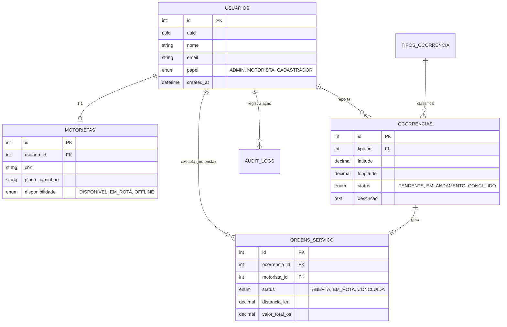

# 📍 ZelaMapa

[](https://fastapi.tiangolo.com/)
[](https://reactjs.org/)
[](https://tailwindcss.com/)
[](https://www.mysql.com/)

**ZelaMapa** é uma solução **GovTech** de ponta desenvolvida para otimizar o zeladoria urbana e a gestão de serviços municipais. Combinando monitoramento em tempo real, inteligência de dados e uma interface intuitiva, o sistema conecta cidadãos, gestores e equipes operacionais para transformar a manutenção das cidades.

---

## 🏗️ Arquitetura do Sistema

O projeto utiliza uma estrutura modular e organizada, separando claramente as responsabilidades:

- **Backend (Python/FastAPI):** Localizado na pasta `/backend`, contém a API Core, a engine de WebSockets, modelos de dados, e a infraestrutura de banco de dados via Docker.
- **Frontend (React/Vite):** Localizado na pasta `/frontend`, contém o dashboard administrativo e a interface mobile-first do motorista, utilizando TypeScript e Tailwind CSS.

---

## 🗄️ Estrutura do Banco de Dados

Nossa modelagem de dados foi projetada para garantir integridade, rastreabilidade (logs de auditoria) e performance analítica.

### Diagrama de Relacionamentos (ER)



---

## 🛠️ Stack Tecnológica

### Backend
- **Framework:** FastAPI
- **ORM:** SQLAlchemy
- **Database:** MySQL 8.0 (Containerizado)
- **Real-time:** Socket.io (ASGI)

### Frontend
- **Framework:** React 19 + Vite
- **Linguagem:** TypeScript
- **Styling:** Tailwind CSS + Shadcn/UI
- **Maps:** Leaflet & OpenStreetMap
- **State:** Zustand

---

## 🚦 Início Rápido

Para rodar o ambiente completo (API + Frontend + DB):

```bash
# Permissão de execução (se necessário)
chmod +x iniciar_projeto.sh

# Inicia tudo simultaneamente
./iniciar_projeto.sh
```

### Comandos do Script Mestre
- `./iniciar_projeto.sh` : Inicia todos os serviços.
- `./iniciar_projeto.sh --stop` : Para todos os serviços e limpa portas.
- `./iniciar_projeto.sh --restart` : Reinicia o ambiente completo.

### 🔐 Credenciais de Apresentação
- **Administrador:** Login: `admin` | Senha: `admin`
- **Motorista:** Login: `motorista` | Senha: `123`

---

## 📐 Organização de Pastas

```bash
.
├── backend/            # Camada de Servidor (FastAPI)
│   ├── api/            # Rotas e Endpoints (v1)
│   ├── core/           # Configurações globais e segurança
│   ├── db/             # Sessão do banco e classes base
│   ├── infra/          # Docker (MySQL) e Schema SQL
│   ├── models/         # Definição de tabelas (SQLAlchemy)
│   ├── schemas/        # Pydantic (Validação e Serialização)
│   ├── scripts/        # Automação, Seed Massivo e Simuladores
│   ├── services/       # Regras de negócio e lógica complexa
│   ├── main.py         # Ponto de entrada da API
│   └── websocket.py    # Engine de Real-time (Socket.io)
├── frontend/           # Camada de Interface (React/Vite)
│   ├── src/            # Código fonte TypeScript
│   │   ├── components/ # UI e Componentes de negócio
│   │   ├── services/   # Integração API/WS
│   │   └── stores/     # Estado Global (Zustand)
│   ├── public/         # Ativos estáticos
│   ├── package.json    # Manifest de dependências
│   └── vite.config.ts  # Configuração do Build
└── iniciar_projeto.sh  # Script mestre de orquestração
```

---

<div align="center">
  <sub>Desenvolvido para o Projeto Integrador - ZelaMapa 2026</sub>
</div>
