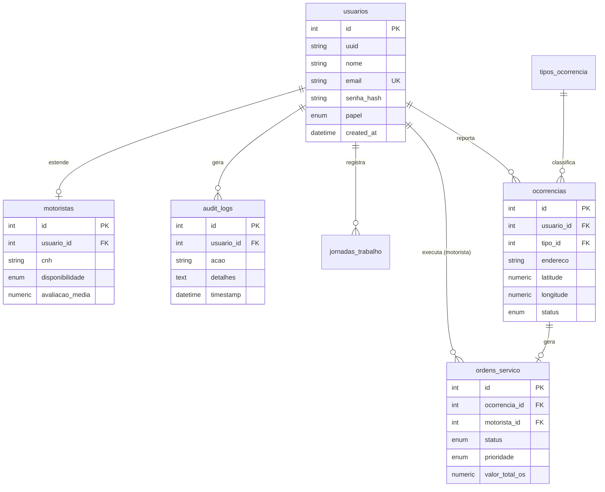

# 🛡️ Documentação de Segurança e Fluxos: ZelaMapa

Esta documentação detalha os mecanismos de autenticação, armazenamento de credenciais e a arquitetura de dados do sistema **ZelaMapa**.

---

## 🔐 1. Protocolos de Segurança

O ZelaMapa utiliza padrões de segurança de nível industrial para proteger a identidade dos usuários e a integridade do sistema.

### 🛡️ Armazenamento de Senhas
As senhas **nunca** são armazenadas em texto plano. O sistema utiliza:
- **Algoritmo:** `bcrypt` (Adaptive Hashing Function).
- **Mecanismo:** Salting automático. O bcrypt gera um "salt" (tempero) aleatório único para cada senha antes de realizar o hash, o que impede ataques de Rainbow Tables.
- **Tratamento:** Limitação de 72 caracteres (padrão bcrypt) para evitar ataques de negação de serviço (DoS) via hashes extremamente longos.

### 🔑 Autenticação e Autorização
- **Token:** `JWT` (JSON Web Token).
- **Algoritmo de Assinatura:** `HS256`.
- **Duração:** 7 dias (configurável via `ACCESS_TOKEN_EXPIRE_MINUTES`).
- **Transporte:** Header `Authorization: Bearer <token>`.

---

## 🚀 2. Fluxos de Autenticação

### 📝 Fluxo de Criação de Conta (Sign Up)
1. **Entrada:** O usuário fornece Nome, Email, Senha e Papel (ADMIN, MOTORISTA, etc.).
2. **Validação:** O sistema verifica se o email já está cadastrado.
3. **Processamento de Senha:** 
   - A senha em texto plano é enviada para a função `get_password_hash`.
   - O `bcrypt` gera o hash com salt aleatório.
4. **Persistência:** O objeto `Usuario` é salvo no banco de dados com o `senha_hash`.
5. **Pós-Processamento:** Se o papel for `MOTORISTA`, uma entrada correspondente é criada na tabela `motoristas` para gerenciar CNH e disponibilidade.

### 🔓 Fluxo de Login
1. **Requisição:** Envio de `username` (email) e `password` via OAuth2 Password Flow.
2. **Identificação:** Busca do usuário pelo email no banco de dados.
3. **Verificação:** 
   - A função `verify_password` compara a senha enviada com o hash armazenado.
   - O `bcrypt` extrai o salt do hash salvo e aplica à senha enviada para validar a compatibilidade.
4. **Auditoria:** Se bem-sucedido, o sistema registra o evento na tabela `audit_logs` e inicia uma entrada na tabela `jornadas_trabalho`.
5. **Resposta:** Retorno de um `access_token` JWT para sessões subsequentes.

---

## 📊 3. Fluxo de Tabelas (MER)

O sistema segue uma arquitetura relacional onde o `Usuario` é o núcleo central de identidade.

### 🗺️ Modelo de Entidade Relacionamento (Mermaid)

---

## ⚠️ 4. Análise de Vulnerabilidades e Soluções

Abaixo estão listadas 3 vulnerabilidades identificadas no protocolo atual e suas respectivas soluções técnicas.

### 1. Ausência de Rate Limiting no Login
- **Vulnerabilidade:** O endpoint `/api/v1/auth/login` não possui limitação de tentativas. Um atacante pode realizar ataques de força bruta (Brute Force) ou preenchimento de credenciais (Credential Stuffing) sem bloqueio.
- **Solução:** Implementar um middleware de Rate Limit (ex: `slowapi` para FastAPI) que bloqueia o IP após X tentativas falhas em um curto período.

### 2. JWT com Expiração Longa (7 dias)
- **Vulnerabilidade:** Se um token for interceptado, o atacante terá acesso total por 7 dias. Não há um mecanismo nativo de revogação de tokens (Blacklist) no backend.
- **Solução:** Reduzir a expiração do Access Token para 15-30 minutos e implementar **Refresh Tokens** armazenados em cookies `HttpOnly` com rotação de chaves.

### 3. Falta de Complexidade de Senha no Backend
- **Vulnerabilidade:** Embora o frontend possua um medidor de força, o backend aceita qualquer string como senha. Isso permite que usuários criem senhas fracas (ex: "123456") via chamadas diretas à API.
- **Solução:** Adicionar validação de esquema (Pydantic) para exigir no mínimo 8 caracteres, letras maiúsculas, números e caracteres especiais no campo `senha` da classe `UsuarioCreate`.

---
**Status da Documentação:** v1.0 (Auditado)
**Data:** 15 de Maio de 2026
